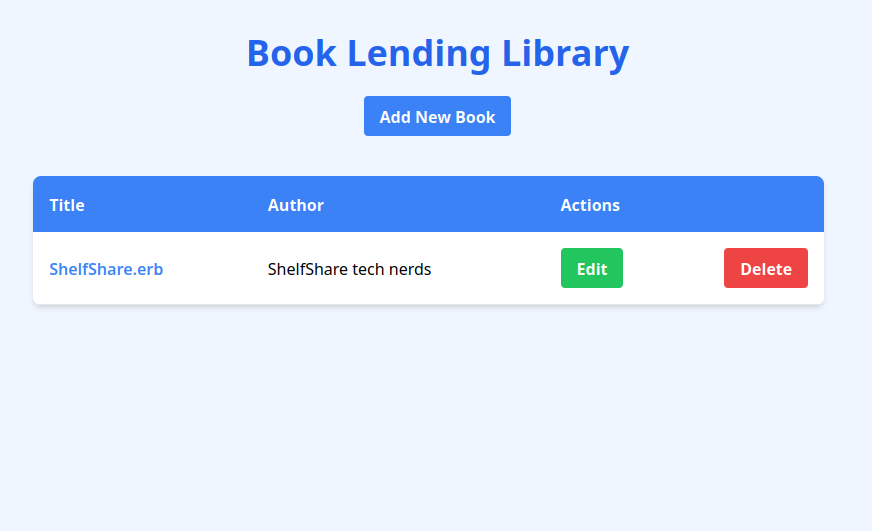
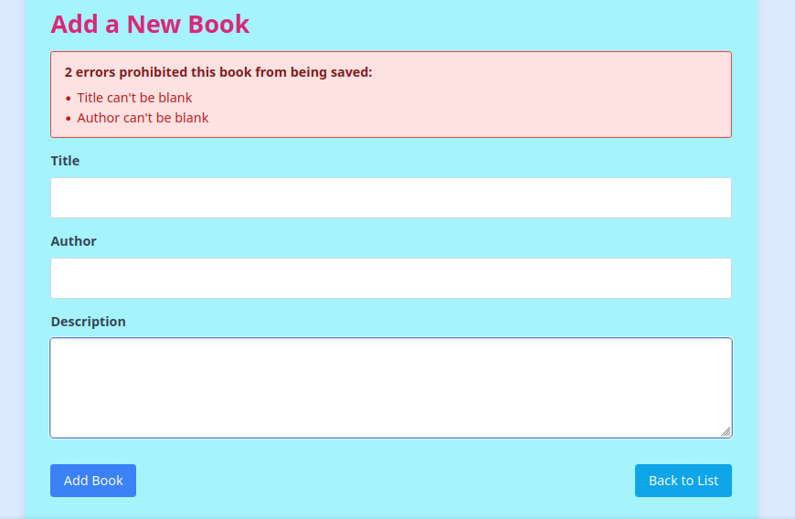
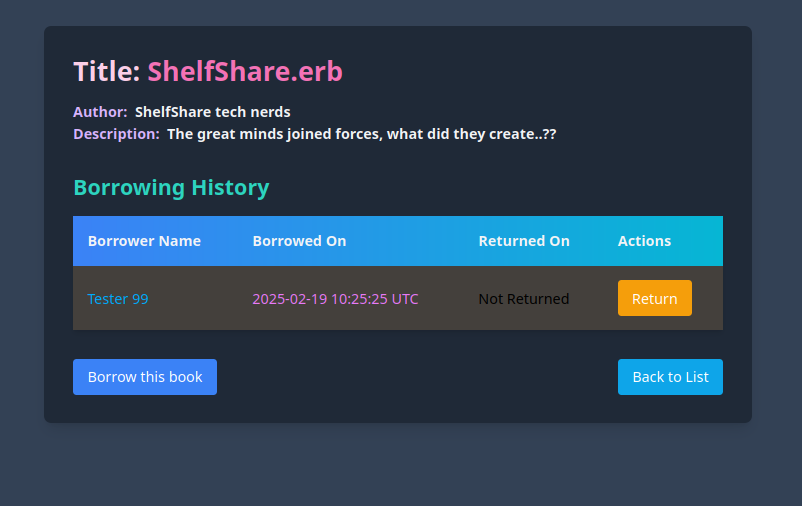
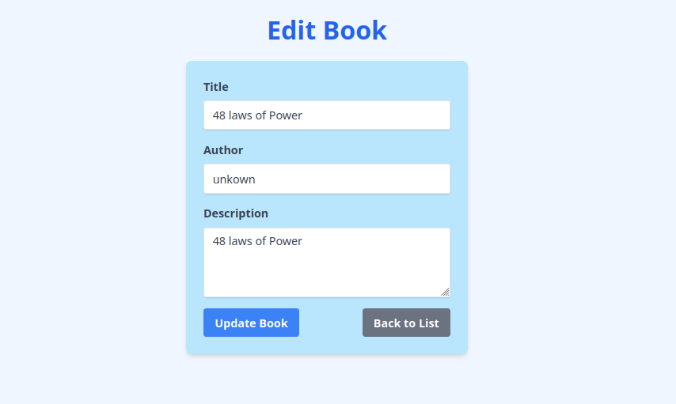
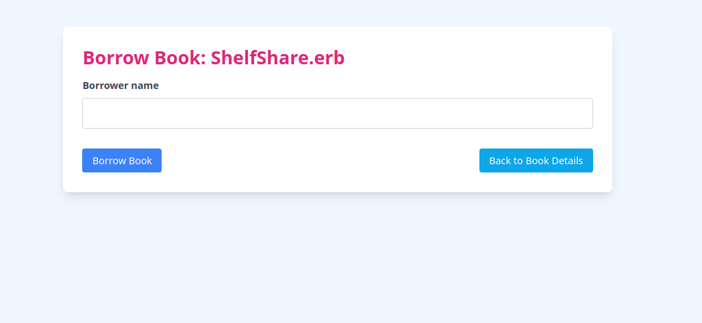

# Book Lending Library

A simple Ruby on Rails application to manage a book lending library.

## Setup

1. **Clone the repository:**
```bash
git clone https://github.com/skye-cyber/ShelfShare.git
cd ShelfShare
```
2. **Install dependencies:**

```bash
bundle install
```
3. **Set up the database:**

```bash
rails db:create
rails db:migrate
```
4. Run the application:

```bash
rails server
```

5. **Open your web browser and visit http://localhost:3000 to see the application.**

---
## Usage

**List all books:**

Navigate to the home page (http://localhost:3000).


**Add a new book:**

Click on ``Add New Book`` to add a new book to the library.


**View book details:**

Click on a book title to see its details and borrowing history.


**Edit a book:**

Click on ``Edit`` next to a book to modify its details.


**Delete a book:**

Click on "Delete" next to a book to remove it from the library.

**Borrow a book:**

From a book's details page, click on ``Borrow this Book`` to borrow it.
Enter the borrower's name and submit the form.


**Return a book:**

From a book's details page, click on ``Return`` next to a borrowing entry to mark it as returned.
**Testing**

To run the tests for the application, use the following commands:

**Run RSpec tests:**

```bash
rspec
```

## Contribution

Feel free to contribute to the project by opening issues or pull requests. Make sure to follow the existing code style and conventions.

## License
This program is free software: you can redistribute it and/or modify
    it under the terms of the GNU General Public License as published by
    the Free Software Foundation, either version 3 of the License, or
    (at your option) any later version.

    This program is distributed in the hope that it will be useful,
    but WITHOUT ANY WARRANTY; without even the implied warranty of
    MERCHANTABILITY or FITNESS FOR A PARTICULAR PURPOSE.  See the
    GNU General Public License for more details.

    You should have received a copy of the GNU General Public License
    along with this program.  If not, see <https://www.gnu.org/licenses/>.
    
  See the LICENSE file for more details. See the [LICENSE](LICENSE) file for details.

----
## Contact
For questions, feedback, or support, feel free to reach out:
- **Email:** [swskye17@gmail.com](mailto:swskye17@gmail.com)
- **GitHub:** [skye-cyber](https://github.com/skye-cyber)

----

